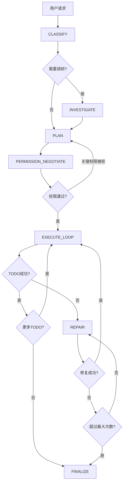

# 🚀 Orchestrator 实施指南 - Phase 2-5

## 📋 概述

本文档描述了Orchestrator Phase 2到Phase 5的完整实现，包括：
- Phase 2: INVESTIGATE深度调研状态
- Phase 3: 完整EXECUTE_LOOP + REPAIR自动修复
- Phase 4: PERMISSION_NEGOTIATE权限协商
- Phase 5: UI组件和集成

**实施日期：** 2025-12-27

---

## 🔬 Phase 2: INVESTIGATE 深度调研状态

### 目标
将现有的deep-planning系统集成到Orchestrator，使AI在执行任务前能深入理解代码库。

### 实现文件
- `cline/src/core/orchestrator/Orchestrator.ts` - INVESTIGATE状态实现
- `cline/src/core/orchestrator/types.ts` - 新增类型定义

### 核心方法

#### 1. buildInvestigationPrompt()
构建调研提示词，引导LLM分析：
- 需要读取的相关文件
- 要搜索的代码模式
- 需要回答的关键问题
- 调研范围估计

```typescript
private buildInvestigationPrompt(): string {
    return `<investigation_task>
    You need to analyze the codebase to understand how to implement this request.
    
    User Request: "${userRequest}"
    Classification: ${JSON.stringify(requestClassification)}
    
    Identify:
    1. Relevant Files
    2. Patterns
    3. Dependencies
    4. Constraints
    5. Key Components
    
    Respond in JSON format...
    </investigation_task>`
}
```

#### 2. parseInvestigationPlan()
解析LLM返回的调研计划：

```typescript
interface InvestigationPlan {
    filesToRead: Array<{ path: string; reason: string }>
    searchPatterns: Array<{ pattern: string; purpose: string }>
    keyQuestions: string[]
    estimatedScope: "small" | "medium" | "large"
}
```

#### 3. executeInvestigation()
执行调研计划：
- 读取相关文件（限制最多5个防止上下文溢出）
- 分析代码模式
- 收集依赖信息
- 识别技术约束

#### 4. buildContextKnowledgeBase()
将调研结果结构化存储：

```typescript
interface ContextKnowledgeBase {
    fileStructure?: Record<string, FileInfo>
    dependencies?: Dependency[]
    patterns?: Pattern[]
    constraints?: Constraint[]
    technicalDebt?: TechnicalDebtItem[]
}
```

### 状态流转
```
CLASSIFY → INVESTIGATE (needsDeepPlanning=true) → PLAN
                    ↓
CLASSIFY → PLAN (needsDeepPlanning=false)
```

---

## ⚙️ Phase 3: 完整EXECUTE_LOOP + REPAIR

### 目标
实现完整的TODO执行循环和智能自动修复系统。

### EXECUTE_LOOP 完整实现

#### 核心特性

1. **依赖顺序执行**
   - `getExecutionOrder()` - 拓扑排序确定执行顺序
   - 处理循环依赖（检测并警告）

2. **依赖检查**
   - `areDependenciesSatisfied()` - 确保前置TODO完成

3. **权限检查**
   - `hasPermissionForTodo()` - 验证执行权限

4. **变更跟踪**
   - `trackChanges()` - 记录文件修改和命令执行

```typescript
private async executeLoop(): Promise<void> {
    const executionOrder = this.getExecutionOrder(this.actionPlan.todos)
    const pendingTodos = executionOrder.filter(
        todo => todo.status === "pending" || todo.status === "in_progress"
    )
    
    for (const todo of pendingTodos) {
        // 检查依赖
        if (!this.areDependenciesSatisfied(todo)) {
            todo.status = "skipped"
            todo.skipReason = "dependencies_not_met"
            continue
        }
        
        // 检查权限
        if (!this.hasPermissionForTodo(todo)) {
            todo.status = "skipped"
            todo.skipReason = "permission_denied"
            continue
        }
        
        // 执行TODO
        try {
            const result = await this.executeTodo(todo)
            const validation = await this.validateTodoResult(todo, result)
            
            if (validation.passed) {
                todo.status = "completed"
                this.trackChanges(todo, result)
            } else {
                todo.status = "failed"
                this.currentState = "REPAIR"
                return
            }
        } catch (error) {
            todo.status = "failed"
            this.currentState = "REPAIR"
            return
        }
    }
    
    this.currentState = "FINALIZE"
}
```

### REPAIR 自动修复实现

#### 修复流程

```
失败检测 → 失败分析 → 策略生成 → 执行修复 → 验证
    ↓                                    ↓
 (最多3次)                          成功: 返回EXECUTE_LOOP
    ↓                                    ↓
 升级用户                           失败: 继续尝试或升级
```

#### 核心方法

1. **analyzeFailure()** - 失败原因分析
   - 调用LLM分析错误
   - 分类失败类型：syntax_error, runtime_error, validation_failure, missing_dependency, permission_denied, timeout, unknown
   - 识别根本原因

2. **generateRepairStrategy()** - 修复策略生成
   - 基于失败分析生成策略
   - 考虑之前的修复尝试（避免重复策略）
   - 包含置信度评估

3. **executeRepair()** - 执行修复
   - 按步骤执行修复操作
   - 准备TODO重新执行

4. **escalateToUser()** - 用户升级
   - 显示失败详情
   - 显示修复历史
   - 提供建议

#### 失败类型处理

| 失败类型 | 默认修复策略 | 置信度 |
|---------|------------|-------|
| syntax_error | 修复语法错误 | 60% |
| missing_dependency | 安装/定位依赖 | 50% |
| permission_denied | 替代方案 | 30% |
| runtime_error | 修改参数重试 | 40% |
| unknown | 通用重试 | 40% |

---

## 🔐 Phase 4: PERMISSION_NEGOTIATE 权限协商

### 目标
实现批量权限请求系统，减少用户交互中断。

### 权限类型

| 类型 | 描述 | 风险等级 |
|-----|------|---------|
| read_file | 读取文件 | low |
| edit_file | 修改文件 | medium |
| create_file | 创建文件 | medium |
| delete_file | 删除文件 | high |
| execute_command | 执行命令 | variable |
| mcp_tool | MCP工具 | medium |

### 核心方法

#### 1. analyzeRequiredPermissions()
从执行计划中提取所需权限：

```typescript
private analyzeRequiredPermissions(plan: ActionPlan): PermissionItem[] {
    const permissions: PermissionItem[] = []
    
    for (const todo of plan.todos) {
        for (const tool of todo.tools) {
            // 根据工具类型确定权限
            switch (tool) {
                case "write_file":
                case "edit_file":
                    permissions.push({
                        type: "edit_file",
                        description: `Modify file: ${todo.inputs.path}`,
                        risk: "medium",
                        critical: true,
                    })
                    break
                // ... 其他工具
            }
        }
    }
    
    return permissions
}
```

#### 2. assessCommandRisk()
评估命令风险等级：

```typescript
private assessCommandRisk(command: string): "low" | "medium" | "high" {
    const lowercaseCmd = command.toLowerCase()
    
    // 高风险命令
    if (lowercaseCmd.includes("rm -rf") || lowercaseCmd.includes("sudo")) {
        return "high"
    }
    
    // 中风险命令
    if (lowercaseCmd.includes("npm install") || lowercaseCmd.includes("docker")) {
        return "medium"
    }
    
    return "low"
}
```

#### 3. requestUserPermissions()
批量请求用户批准：

```typescript
private async requestUserPermissions(request: PermissionRequest): Promise<string[]> {
    // 构建权限摘要
    let summaryText = `**${request.message}**\n\n`
    
    request.permissions.forEach((p, i) => {
        const emoji = { low: "🟢", medium: "🟡", high: "🔴" }[p.risk]
        summaryText += `${i + 1}. ${emoji} ${p.description}\n`
    })
    
    await this.task.say("text", summaryText)
    
    // 返回批准的权限
    return request.permissions.map(p => p.type)
}
```

### 状态流转

```
PLAN → PERMISSION_NEGOTIATE → EXECUTE_LOOP
                ↓
        (如果关键权限被拒绝)
                ↓
           重新规划
```

---

## 🎨 Phase 5: UI组件和集成

### 目标
创建可视化组件展示Orchestrator状态，并完成系统集成。

### 新增文件

```
cline/webview-ui/src/components/orchestrator/
├── OrchestratorStatus.tsx    # 主状态组件
└── index.ts                  # 导出

cline/webview-ui/src/hooks/
└── useOrchestratorState.ts   # 状态管理Hook
```

### OrchestratorStatus组件

#### 功能
- 状态进度条（显示当前在哪个状态）
- 分类徽章（显示复杂度、风险等级）
- TODO列表（实时状态更新）
- 当前状态详情

#### 使用方式

```tsx
import { OrchestratorStatus } from "./components/orchestrator"

<OrchestratorStatus 
    jobContext={orchestratorContext}
    isActive={true}
/>
```

### useOrchestratorState Hook

#### 功能
- 管理Orchestrator状态
- 监听扩展消息
- 更新UI

```typescript
const {
    jobContext,           // 当前任务上下文
    isOrchestratorMode,   // 是否启用
    isActive,             // 是否运行中
    setOrchestratorMode,  // 启用/禁用
    updateJobContext,     // 更新上下文
    reset,                // 重置状态
} = useOrchestratorState()
```

### Webview通信

#### 消息类型
- `orchestrator_update` - 状态更新
- `orchestrator_start` - 开始执行
- `orchestrator_end` - 执行结束
- `orchestrator_reset` - 重置状态

#### 发送更新

```typescript
// Orchestrator.ts
private sendStatusToWebview(): void {
    this.controller.postMessageToWebview?.({
        type: "orchestrator_update",
        context: {
            jobId: this.jobContext.jobId,
            currentState: this.currentState,
            actionPlan: this.actionPlan,
            // ...
        },
    })
}
```

---

## 📊 完整状态流转图



---

## 🧪 测试验证

### 单元测试
- Orchestrator实例化
- 状态转换
- 权限分析
- 修复策略生成

### 集成测试
- 端到端流程
- 失败和修复场景
- 权限协商流程

### 手动测试
1. 启动VSCode
2. 打开测试项目
3. 发送测试请求（如："添加登录功能"）
4. 观察状态流转
5. 验证输出

---

## 📝 后续优化建议

1. **性能优化**
   - 调研结果缓存
   - 并行TODO执行（无依赖时）

2. **智能化**
   - 学习用户偏好
   - 自适应修复策略

3. **UI增强**
   - 交互式TODO编辑
   - 可视化依赖图
   - 回滚操作界面

4. **集成深化**
   - 与CBB系统集成
   - 与诊断系统集成

---

**创建时间：** 2025-12-27  
**状态：** ✅ 完成  
**负责人：** AI Assistant

