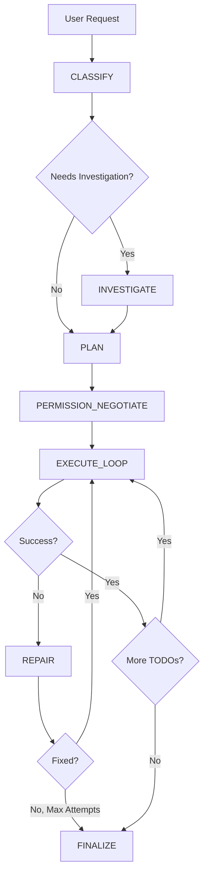

# 🎯 Orchestrator Architecture Summary

## 🌟 What is the Orchestrator?

The **Orchestrator** is an intelligent command-and-control system that transforms the AI assistant from a simple Q&A chatbot into a **senior engineer** that can:

- 🔍 **Investigate** - Understand the codebase before making changes
- 📋 **Plan** - Create structured, trackable execution plans
- 🔄 **Execute** - Carry out plans step-by-step with validation
- 🛠️ **Repair** - Automatically diagnose and fix failures
- ✅ **Finalize** - Deliver complete results with rollback points

---

## 🏗️ Architecture Overview

### State Machine Flow



---

## 🎯 Key Features

### 1. **Intelligent Classification**

Before doing anything, the Orchestrator analyzes the request:

```
Input: "Add login functionality"

Classification:
- Type: multi_file_edit
- Needs Deep Planning: true
- Complexity: high
- Risk Level: moderate
- Tools: read_file, edit_file, execute_command
```

### 2. **Deep Investigation (Integration with existing deep-planning)**

For complex tasks, triggers silent investigation:

```
[INVESTIGATE]
→ Reading auth.ts...
→ Checking dependencies...
→ Found: JWT auth system
→ Found: Existing user model
→ Pattern: Express middleware for auth
→ Constraint: Must maintain backward compatibility
```

### 3. **Structured Planning**

Creates actionable, trackable plans:

```
[PLAN]
Strategy: Implement OAuth2 login flow with existing JWT system

TODOs:
1. ✅ Create OAuth routes in auth.ts
   Tools: edit_file
   Accept: Route handlers return 200, no syntax errors

2. ⏸️ Add Google OAuth config
   Tools: edit_file, read_file
   Accept: Config loaded, env vars validated

3. ⏸️ Update frontend LoginForm.tsx
   Tools: edit_file
   Accept: Component renders, no console errors

Risks:
- Breaking existing login → Mitigation: Create checkpoint before changes
- OAuth secrets not configured → Mitigation: Validate env vars first
```

### 4. **Permission Negotiation**

Batch permission requests (minimize interruptions):

```
[PERMISSION_NEGOTIATE]
This task requires:
✅ Modify 2 existing files (auth.ts, config.ts)
✅ Create 1 new file (LoginForm.tsx)
✅ Run command: npm install passport-google-oauth20
❌ Delete 0 files

[Approve All] [Review Each] [Cancel]
```

### 5. **Self-Healing Execution**

Automatic error recovery:

```
[EXECUTE] TODO 1: Create OAuth routes
→ Editing auth.ts...
❌ Error: Syntax error on line 45

[REPAIR] Attempt 1/3
→ Analyzing error: Missing closing bracket
→ Strategy: Add closing bracket at line 45
→ Re-executing...
✅ Success!
```

### 6. **Complete Reporting**

Comprehensive results:

```
[FINALIZE]
✅ Job Completed Successfully

Summary:
- Total TODOs: 5
- Completed: 5
- Failed: 0
- Duration: 3m 24s

Changes:
- Modified: auth.ts (+45, -12)
- Modified: config.ts (+8, -2)
- Created: LoginForm.tsx (+156)

Checkpoint: checkpoint_abc123
Rollback: git checkout checkpoint_abc123

Recommendations:
1. Run: npm test
2. Verify: OAuth callback URL in Google Console
3. Test: Login with Google button on /login
```

---

## 🔧 Technical Implementation

### Core Components

```
cline/src/core/orchestrator/
├── Orchestrator.ts           # Main state machine
├── types.ts                  # Type definitions
├── states/
│   ├── ClassifyState.ts      # Classification logic
│   ├── InvestigateState.ts   # Deep planning integration
│   ├── PlanState.ts          # Plan generation
│   ├── PermissionState.ts    # Permission negotiation
│   ├── ExecuteState.ts       # TODO execution
│   ├── RepairState.ts        # Auto-repair logic
│   └── FinalizeState.ts      # Reporting
├── utils/
│   ├── LLMCaller.ts          # LLM API wrapper
│   ├── PlanParser.ts         # Plan parsing
│   └── PermissionAnalyzer.ts # Permission analysis
└── __tests__/
    └── Orchestrator.test.ts  # Tests
```

### Integration Points

1. **Task Class** - Entry point for orchestrated execution
2. **Deep Planning** - Reuse existing investigation system
3. **Tool Executor** - Execute file operations, commands
4. **Message Handler** - UI communication
5. **Checkpoint Manager** - Create rollback points

---

## 📈 Impact

### Before (Current)

```
User: "Add login functionality"
AI: "I'll modify auth.ts"
    [Edits file directly]
    [Might miss related files]
    [No recovery if fails]
    [User must guide on errors]
```

**Issues:**
- ❌ No investigation
- ❌ No planning
- ❌ No validation
- ❌ No recovery
- ❌ Incomplete results

### After (Orchestrator)

```
User: "Add login functionality"
AI: 
    [CLASSIFY] Multi-file task, high complexity
    [INVESTIGATE] Found: JWT system, Express routes
    [PLAN] Created 5-step plan
    [PERMISSION] Requesting: edit 2 files, create 1 file
    [EXECUTE] Step 1/5... ✅
    [EXECUTE] Step 2/5... ❌ Syntax error
    [REPAIR] Fixing: Missing bracket
    [EXECUTE] Step 2/5... ✅
    [EXECUTE] Step 3/5... ✅
    [EXECUTE] Step 4/5... ✅
    [EXECUTE] Step 5/5... ✅
    [FINALIZE] Complete! 5/5 tasks done
               Checkpoint: checkpoint_abc123
               Next: Run tests
```

**Improvements:**
- ✅ Understands context
- ✅ Creates plan
- ✅ Validates each step
- ✅ Auto-recovers from errors
- ✅ Complete with recommendations

---

## 🚀 Implementation Roadmap

### Phase 1: Core Framework (1-2 weeks)
- [ ] Basic state machine
- [ ] CLASSIFY state
- [ ] PLAN state
- [ ] Simple EXECUTE_LOOP
- [ ] FINALIZE state
- [ ] Integration with Task

### Phase 2: Deep Planning (1 week)
- [ ] INVESTIGATE state
- [ ] Integration with existing deep-planning
- [ ] Context knowledge base

### Phase 3: Execution & Repair (2 weeks)
- [ ] Full EXECUTE_LOOP with validation
- [ ] REPAIR state with auto-recovery
- [ ] Error diagnosis and strategy generation

### Phase 4: Permissions & UI (1 week)
- [ ] PERMISSION_NEGOTIATE state
- [ ] Permission analysis
- [ ] UI components for plan display

### Phase 5: Polish & Testing (1-2 weeks)
- [ ] Performance optimization
- [ ] Edge case handling
- [ ] Comprehensive testing
- [ ] Documentation

**Total: 6-8 weeks**

---

## 🎯 Success Criteria

Phase 1 is successful when:

1. ✅ Can classify user requests
2. ✅ Can generate execution plans
3. ✅ Can execute simple TODOs
4. ✅ Can report results
5. ✅ End-to-end flow works for basic cases

Full Orchestrator is successful when:

1. ✅ Handles complex multi-file tasks
2. ✅ Automatically investigates codebase
3. ✅ Creates detailed, trackable plans
4. ✅ Auto-recovers from failures
5. ✅ Provides complete results with rollback points
6. ✅ Users feel like working with a senior engineer

---

## 📚 Documentation

- **Architecture Design**: `docs/ORCHESTRATOR_DESIGN.md`
- **Phase 1 Guide**: `docs/ORCHESTRATOR_PHASE1_GUIDE.md`
- **API Reference**: `docs/ORCHESTRATOR_API.md` (TODO)
- **User Guide**: `docs/ORCHESTRATOR_USER_GUIDE.md` (TODO)

---

## 🤝 Contributing

This is a major architectural improvement. If you want to contribute:

1. Read `docs/ORCHESTRATOR_DESIGN.md` for full context
2. Start with Phase 1 tasks in `docs/ORCHESTRATOR_PHASE1_GUIDE.md`
3. Follow the existing code style
4. Write tests for new functionality
5. Update documentation

---

## ❓ FAQ

**Q: Why not just improve the existing system?**  
A: The current system is reactive (responds to each message). Orchestrator is proactive (plans ahead, validates, recovers).

**Q: Won't this be slower?**  
A: Initial planning takes time, but overall faster due to fewer errors and retries.

**Q: What about simple questions?**  
A: CLASSIFY detects simple Q&A and skips unnecessary steps.

**Q: Can users disable it?**  
A: Yes, users can choose "quick mode" (current system) or "orchestrated mode".

**Q: How does it differ from existing deep-planning?**  
A: Deep-planning is for investigation only. Orchestrator adds: classification, structured planning, permission management, execution control, and auto-repair.

---

**Status**: 🟡 Design Complete, Implementation Starting  
**Priority**: 🔴 High (Core Feature)  
**Estimated Effort**: 6-8 weeks  
**Created**: 2025-12-26

